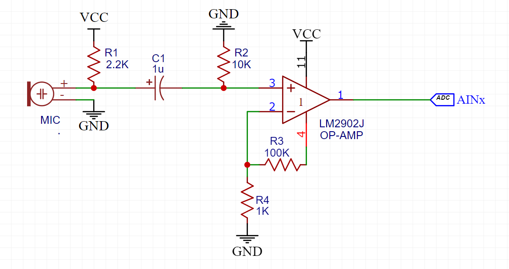

# AoA-Device
An embedded systems project to tackle the real-world problem of the high computational power requirement of AoA (Angle of Arrival) devices using the TM123GH6PM microcontroller under low power and low cost. 

## Hardware Features
- ARM M4F based TM123GH6PM
- Electronic components used:
    |   Components   |  Qty |
    | -------------- |:----:|
    | LM2902 Op-amp  |  1 |
    |CMC-9745-44P Mic| 4 |
    | 2.2kΩ resistor | 4 |
    | 1kΩ resistor   | 4 |
    | 10kΩ resistor  | 4 | 
    | 100kΩ resistor | 4 |
    | 0.1μF capacitor| 2 |
    | 1μF capacitor  | 4 |
    | 10μF capacitor | 1 |
-  
    |   Peripherals    used     |
    | --------------------------|
    | ADC0 (Sequence Sampler)   |
    | ADC1 (Digital Comparator) |
    | Timers                    |
    | NVIC                      |
    | DMA                       |
    | UART                      |

### Circuit Diagram

 Each microphone utilizes this circuit 

## Software Features
Using UART, these commands can be given as input to the microcontroller.
- `reset`: This command sends a request to the M4F board to reset the hardware. The reset request is performed via `NVIC_APINT_SYSRESREQ`
- `average`: Displays an average value of each microphone in DAC units.
- `level`: Sets the threshold detection range for the digital comparator.
- `aoa`: Displays the most current value of the Angle of Arrival of an event.
- `aoa always`: Displays the Angle of Arrival every time an event is detected.
- `tdoa`: Displays the Time Difference of Arrival information of the mics for an event.